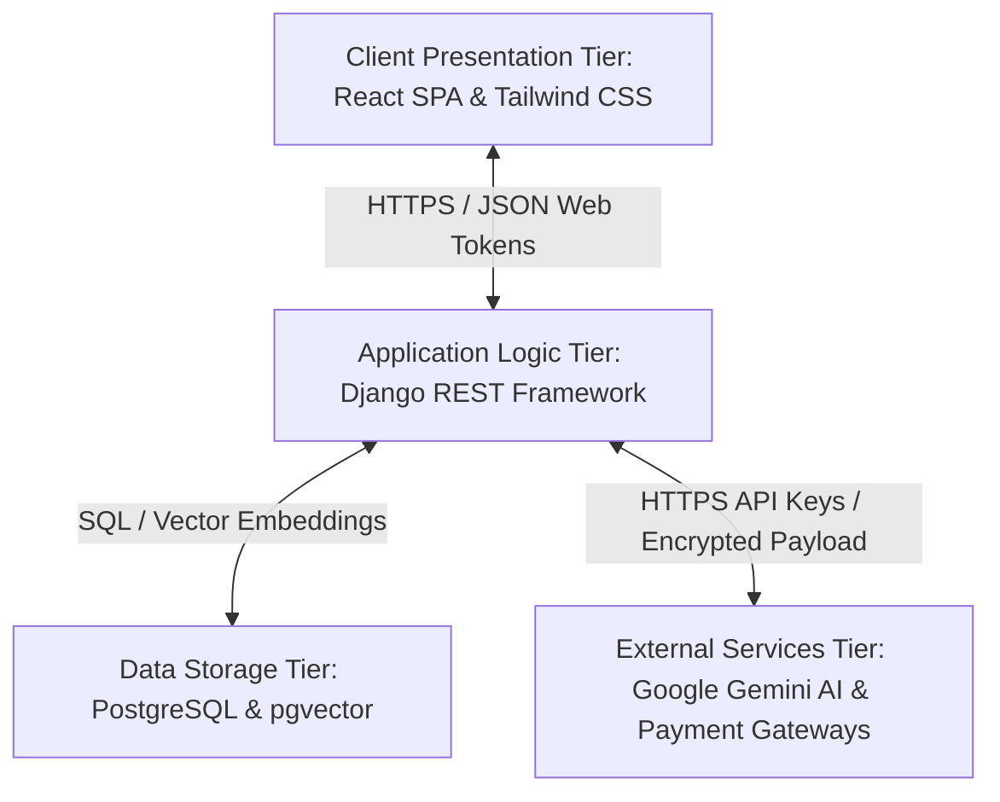

# Papyrus Plaza: Online Bookstore Management System

Welcome to the **Papyrus Plaza Bookstore Management System** (also known as the Online Book Store). This is a modern, high-performance, and feature-rich multi-tier web application built to coordinate standard retail storefront operations with administrative management, B2B wholesale replenishment workflows, self-publishing cloud telemetry channels, and context-aware artificial intelligence virtual assistance.

The application leverages a decoupled client-server architecture containing a React frontend, a Django REST Framework (DRF) backend, a PostgreSQL database, and third-party integrations forming an External Services Tier.

---

## 🚀 Key Feature Modules by Role

The system implements Role-Based Access Control (RBAC) to enforce security and separate operational logic across four distinct user personas:

### 1. 🛒 Customers (Retail)
* **Storefront Catalog**: Browse and search real-time retail listings, filter by authors or titles, and view detailed descriptions.
* **Shopping Cart & Checkout**: Add/remove books, update quantities, and submit billing details via a simulated secure payment validation controller.
* **AI Chatbot Assistant**: Ask questions and receive real-time context-aware recommendations based on current catalog inventories. Powered by Retrieval-Augmented Generation (RAG) using `gemini-2.5-flash` to prevent off-domain queries or system hallucinations.

### 2. ✍️ Writers (Self-Publishing Studio)
* **Manuscript Upload Portals**: Self-publish by uploading digital books in standard formats (`.pdf`, `.epub`, `.docx`).
* **Cloud Storage Analytics**: Monitor cumulative storage space limits and word count metrics via an interactive analytical dashboard featuring time-series charts.

### 3. 🏢 Store Owners / B2B Suppliers
* **Wholesale Catalogs**: Create, read, update, and delete wholesale catalog items with distinct listing structures.
* **Bulk Purchase Orders**: Manage and submit bulk orders to supply inventories to the main bookstore.
* **Discount Processing**: System triggers automatic discount logic (e.g., 15% wholesale discount) when order quantities satisfy threshold criteria (e.g., 50+ units).

### 4. 👑 Administrators / Managers
* **B2B Pipeline Control**: Approve, ship, or cancel bulk purchase orders placed to suppliers.
* **Storefront Replenishment**: Accept and commit shipped bulk orders to retail inventory levels automatically.
* **Telemetry & Logging**: Access transaction statuses, catalog counts, and audit logs.

---

## 🛠️ Technology Stack

| Layer | Technology | Key Details |
| :--- | :--- | :--- |
| **Frontend** | React, Vite, JavaScript | Single Page Application (SPA) structure, React Router DOM v7 for routing, Axios for HTTP request pipelining. |
| **Styling & UI** | Tailwind CSS v4, Framer Motion, GSAP, Recharts | Premium, responsive visual system featuring micro-animations, glassmorphism components, and SVG/Canvas analytics charts. |
| **Backend** | Python 3.13, Django 6.0, Django REST Framework | RESTful API structure, JWT Authentication (SimpleJWT), Custom Permission Classes. |
| **Database** | PostgreSQL | Optimized indices, ACID-compliant transaction concurrency management, and pgvector support for semantic retrieval. |
| **AI / RAG engine** | Google Gemini API (`gemini-2.5-flash`) | Keyword-based vector matching mapping PostgreSQL results directly to prompt context variables. |

---

## 📐 System Architecture

The bookstore management system is partitioned into four decoupled tiers to maximize scalability, database consistency, and security boundaries:



1. **Presentation Layer**: Built on Vite and React. Captures actions, updates visual dashboards, maintains routing, and leverages Axios interceptors to auto-refresh expired JWT tokens.
2. **Application Layer**: Python-based Django REST Framework handling business rules, token security validation, database calls, and piping manuscript streams.
3. **Data Layer**: PostgreSQL database housing entity tables (`User`, `Book`, `Order`, `Review`, etc.) with transaction locking guards preventing stock double-selling.
4. **External Services Tier**: Manages heavy computational generation (Gemini Generative SDK) and mock payment verification decoupled from the core bookstore database structure. For design specs, see [external_services_tier.md](file:///d:/Nyeras_book_store/docs/external_services_tier.md).

---

## ⚙️ Installation & Local Setup

### Prerequisites
* **Python** 3.13 or higher
* **Node.js** v18 or higher
* **PostgreSQL** 16 (or local database configuration)

### Backend Setup
1. Navigate to the backend directory:
   ```bash
   cd backend
   ```
2. Create and activate a Python virtual environment:
   ```bash
   python -m venv venv
   # On Windows:
   .\venv\Scripts\activate
   # On macOS/Linux:
   source venv/bin/activate
   ```
3. Install the dependencies:
   ```bash
   pip install -r requirements.txt
   ```
4. Configure environment variables in `.env` (e.g., database credentials, `GEMINI_API_KEY`, etc.).
5. Apply database migrations:
   ```bash
   python manage.py migrate
   ```
6. Create an administrator user:
   ```bash
   python manage.py createsuperuser
   ```
7. Start the Django development server:
   ```bash
   python manage.py runserver
   ```

### Frontend Setup
1. Navigate to the frontend directory:
   ```bash
   cd ../frontend
   ```
2. Install npm dependencies:
   ```bash
   npm install
   ```
3. Launch the Vite dev server:
   ```bash
   npm run dev
   ```

---

## 🧪 Quality Assurance & Software Testing

The system includes a rigorous, multi-methodology validation test suite designed to ensure robustness across edge cases.

### The 6-Tier Testing Methodology
1. **Unit Testing**: Isolated verification of JWT serializers, custom discount calculation methods, and token math.
2. **Integration Testing**: Multi-component checks including JWT token interceptor behavior, pgvector context fetching, and S3 file integrations.
3. **System Testing**: End-to-end user lifecycles (e.g., register $\rightarrow$ login $\rightarrow$ bulk checkout $\rightarrow$ stock depletion).
4. **Boundary Value Analysis**: Stress-testing limits (e.g., file sizes at exactly 20.00MB vs 20.01MB, email characters at 254 vs 255).
5. **Equivalence Partitioning**: Grouping valid/invalid input ranges for bulk order quantities and file extension subsets.
6. **Regression Testing**: Ensuring updates to libraries or database schemas do not impact catalog load speeds or checkout actions.

For detailed test definitions, check [software_testing_report.md](file:///d:/Nyeras_book_store/docs/software_testing_report.md).

### Running the Test Suite
To execute the automated validation tests and compile real-time telemetry:
1. Navigate to the backend folder:
   ```bash
   cd backend
   ```
2. Run the test suite:
   ```bash
   python run_validation_test_suite.py
   ```
3. This generates an interactive HTML dashboard highlighting pass/fail metrics, transaction durations, and log traces. Open [testing_validation_dashboard.html](file:///d:/Nyeras_book_store/docs/testing_validation_dashboard.html) in your browser to inspect test results.
