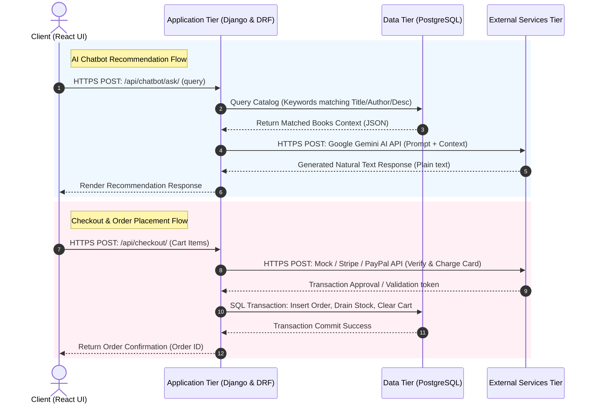

# Papyrus Online Book Store: External Services Tier Specifications

This document details the architecture, component integrations, data flow, and security protocols of the **External Services Tier** for the Papyrus Online Book Store.

The External Services Tier is the fourth tier in the system's architecture, decoupled from the core application logic. It delegates specialized tasks—such as AI-powered Retrieval-Augmented Generation (RAG) recommendations and financial transaction processing—to third-party service providers via secure APIs.

---

## 1. Architectural Role and Integration

By decoupling these services into an external tier, the system achieves:
* **High Modularity**: Third-party APIs can be swapped or upgraded (e.g., migrating from a Mock Payment API to live Stripe/PayPal production environments) with minimal refactoring of core business logic.
* **Reduced Computational Load**: Heavy computations (like deep neural network inference for AI generation) are offloaded to Google's specialized infrastructure.
* **Compliance & Security Isolation**: Isolating checkout verification limits the scope of regulatory compliance (such as PCI-DSS) within the core bookstore database and application tier.



---

## 2. Component 1: Google Gemini AI API (RAG Engine)

The system utilizes the **Google Gemini AI API** to power the interactive bookstore virtual assistant, allowing customers to receive context-aware recommendations based on the bookstore's current catalog.

### Technical Profile
* **Core Service**: Google Generative AI Developer Suite
* **Active Model**: `gemini-2.5-flash` (configured in [rag_service.py](file:///d:/Nyeras_book_store/backend/api/rag_service.py#L50))
* **Primary Script**: [rag_service.py](file:///d:/Nyeras_book_store/backend/api/rag_service.py)
* **Functionality**: Text generation & Retrieval-Augmented Generation (RAG)

### Retrieval-Augmented Generation (RAG) Process Flow
1. **Keyword Retrieval**: The user's query is parsed in [generate_rag_response](file:///d:/Nyeras_book_store/backend/api/rag_service.py#L7) into keyword tokens. The Django ORM queries the database for books containing matches in their title, description, or author name, capping the result at the top 5 matches to optimize payload size:
   ```python
   matched_books = Book.objects.filter(query).distinct()[:5]
   ```
2. **Context Augmentation**: If matching books are found, a structured context block is dynamically constructed listing titles, authors, prices, stock statuses, and descriptions.
3. **Prompt Engineering & System Directives**: The system wraps the query and catalog context into a system prompt:
   * **Persona**: Friendly, helpful virtual assistant for *Papyrus Plaza*.
   * **Constraints**: Answer using **only** the provided real-time inventory context. If the book is not in stock or in the context, politely prompt the user to browse the full catalog.
   * **Formatting**: Plain text only, concise (1-3 sentences), no markdown or listing syntax.
4. **Completion Generation**: The prompt is sent to `gemini-2.5-flash` using `generativeai` SDK. The response is returned to the user via the `/api/chatbot/ask/` API handler in [views.py](file:///d:/Nyeras_book_store/backend/api/views.py#L460).

> [!NOTE]  
> The system retrieves books dynamically from database records to feed into the prompt context, bypassing the need to retrain or fine-tune the Gemini model when new stock is added or updated.

---

## 3. Component 2: Payment Gateway API (Mock / Stripe / PayPal)

The checkout system processes transactions through a simulation interface (representing payment gateways like Stripe or PayPal) to validate customer billing information and charge credit cards before finalizing order state changes.

### Technical Profile
* **Core Service**: Mock Payment Verification & Transaction Controller
* **Primary View**: [CheckoutView](file:///d:/Nyeras_book_store/backend/api/views.py#L132)
* **Functionality**: Transaction validation, credit card charge simulation, and status verification.

### Transaction Processing Flow
1. **Request Reception**: The customer submits a checkout request to `/api/checkout/` with authenticated credentials (JWT bearer header).
2. **Billing Verification**: The total order cost is calculated dynamically in the application logic tier:
   ```python
   total_amount = sum(item.quantity * item.book.price for item in cart_items)
   ```
3. **External Gateway Dispatch**: The application tier issues a mock API request simulating an external HTTP call to a provider (Stripe/PayPal) to charge the cards.
4. **Atomic Transaction Rollback**: If the payment is validated successfully, the database transaction is executed inside an atomic transaction wrapper (`@transaction.atomic` in [views.py](file:///d:/Nyeras_book_store/backend/api/views.py#L135)). This guarantees that:
   * The order and order items are saved.
   * Catalog inventory stock levels are decremented correctly.
   * The user's shopping cart items are cleared.
   * If any step fails, the payment status is rolled back, preventing race conditions or double-sell scenarios.

> [!IMPORTANT]  
> To shift from testing to a production checkout flow, developers swap the mock verification helper with the official `stripe` or `paypal-checkout-sdk` library calls inside the `CheckoutView.post()` transaction context.

---

## 4. Security Protocols and Configuration

Communication with the External Services Tier is strictly controlled using modern web security protocols:

| Security Dimension | Protocol / Standard | Implementation Details |
| :--- | :--- | :--- |
| **Transport Encryption** | HTTPS / TLS 1.3 | All API requests to Google Gemini and Payment Gateways are encrypted in transit. |
| **Credential Management** | Environment Variables | API keys (e.g., `GEMINI_API_KEY`) are managed through `settings.py` and loaded securely using `os.environ` to keep credentials out of source control. |
| **Authorization** | JWT Bearer Tokens | User checkout endpoints require client authorization headers using JSON Web Tokens (JWT) verified via SimpleJWT middleware. |
| **Database Consistency** | Django ACID Transactions | Multi-table mutations following payment verification are wrapped in `@transaction.atomic` database transactions. |
| --- |
